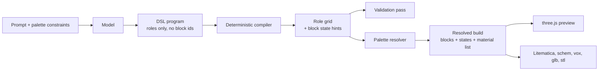

# Architecture

MineBench turns a prompt into a Minecraft build in four stages, and keeps block
identity out of the first three. What the model writes is a program describing
structure; what a palette decides is which blocks that structure is made of.

## The pipeline

The saved artifact is the program plus its seed. Re-running it is deterministic,
so a build can be edited, re-compiled and re-palletted without ever asking the
model again.

## Stage 1: the DSL

`lib/dsl/` exposes a fixed structural API: a mass with storeys, walls, corners,
floors, openings, roofs, and the transforms `mirrorX`, `mirrorZ`, `repeat` and
`translate`. Every op takes a semantic role, never a block id, and any invalid
argument throws with the op name, its position in the program, and its
arguments.

The program runs in a `node:vm` context with a null prototype that holds only
`build` and `Math`: no timers, no filesystem, no network, and code generation
from strings disabled. This is the same trust model already used for the older
`voxel.exec` path: adequate for model-authored code against a fixed API, and not
a boundary against a hostile actor sharing the process.

`docs/dsl.md` is the single source of truth for the op list. The system prompt
is generated from it (`pnpm dsl:prompt`) and a test fails if the two drift.

## Stage 2: the compiler

`lib/compile/` executes the recorded ops into a `RoleGrid`: a map of cells, each
carrying a role, a form (`full`, `slab` or `stair`) and block state hints
(`facing`, `half`, `axis`, `shape`). Later ops overwrite earlier ones at the
same coordinate.

Stairs and slabs are resolved here, because the compiler knows the roof plane
and the model does not. Stair facing follows the vanilla model data, where
`facing` points at the tall side of the stair; corner shapes are derived in a
second pass over the finished surface.

`mirrorX`, `mirrorZ` and `repeat` execute their body once and transform the
cells it produced, mirroring derived facings and stair shapes with them. The
symmetric half is therefore produced by the compiler, not typed out twice by the
model.

## Stage 3: the palette

`lib/palette/` maps roles to blocks. A role binding names a block, or a colour
ramp whose members are ordered by Oklab lightness and picked per cell from a
coordinate hash. Palette-declared block states are merged under the states the
compiler derived, and only properties the block actually has are emitted.

Resolution never touches the grid, so swapping a palette is a second resolve of
the same artifact. A test asserts this, and asserts that nothing under
`lib/palette/` can import the DSL or the compiler.

The same layer produces the material list and measures it against a cost ceiling
and a distinct block limit. Acquisition groups, derived from vanilla recipe data
by walking outputs back to root ingredients, let all the stonecutter outputs of
one material count once; until that data is supplied the table is empty and the
budget report says so rather than pretending the grouping happened.

## Validation

`lib/repair/` reports, and never fixes:

- components with no path to the lowest layer of the build
- whether an enclosed, non-solid interior exists
- empty cells sitting in a surface that were not declared as an opening
- mirrored cells that a later op overwrote on one side only

Every one of these can be deliberate, so findings carry coordinates and go to
the person looking at the build.

## Rendering and export

The three.js renderer (`lib/voxel/`, `components/voxel/`) meshes full cubes
only. `lib/build/renderAdapter.ts` converts a resolved build for it, flattening
stairs and slabs to their base block and reporting every substitution it had to
make. Exports carry the exact block and state, so what gets placed in the world
is correct even where the preview simplifies it. Sub-cube preview geometry is a
separate piece of work.

`lib/voxel/export/` writes Litematica, Sponge schematics, MagicaVoxel, glTF and
STL. The Litematica writer is checked by a round trip test that reads its own
output back and compares block for block, including block states.

## Persistence

Prisma on PostgreSQL holds accounts, saved generations and their artifacts, and
anonymous presence. Generation runs as a job queue drained by a worker
(`lib/custom-builds/`), with artifacts in object storage.
